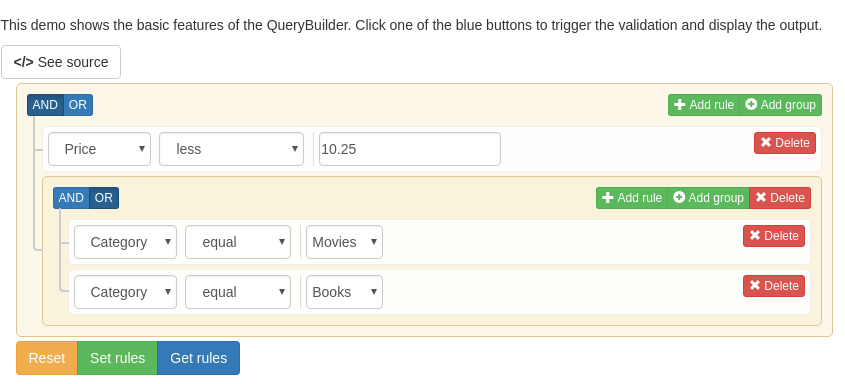
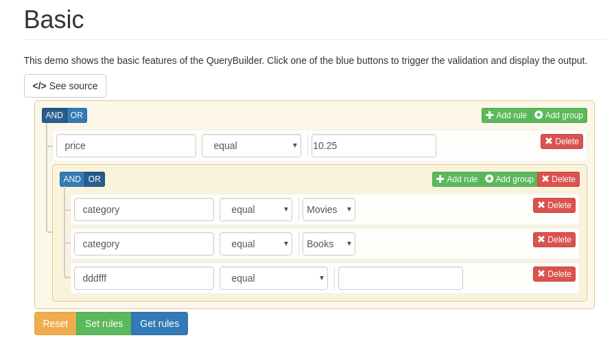
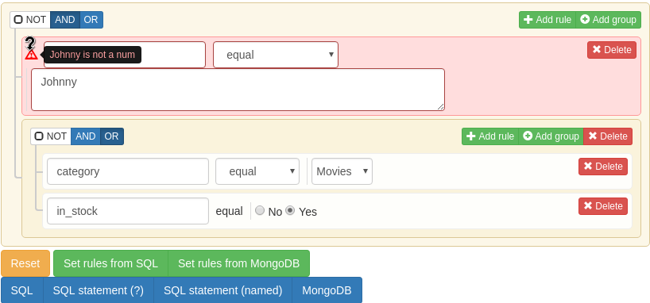

# 令jQuery QueryBuilder支持字段名输入
jQuery QueryBuilder是一个友好的查询构造组件。



默认的jQuery QueryBuilder字段名只能用select进行选择，由于工作中有任意字段输入的需要，所以进行了改造。

## 使用
在引入jQuery QueryBuilder相关组件后，引入QueryBuilder_input.js即可。

字段在设定的filters中则会取该filter，如果未设置filter，则会使用默认filter。

默认的filter设置为:
```
{
    type:'string',
    input:'input'
}
```

效果如下图(demo.html):


## 自定义默认filter与默认validation

例子：
```Javascript
$('#builder-import_export').queryBuilder({
  plugins: [
    'bt-tooltip-errors',
    'not-group'
  ],
  //设置为双行textarea
  default_filter:{
      type:'string',
      input:'textarea',
      rows:2,
      size:"60%"
  },
//设定检测函数，检测字段是否为数字
  default_validation:function(value,rule){
    if(!isNaN(value)){
      return true
    }
    return value+" is not a num"
  }
  ,
   filters: [....]
}
  ```
非filters中定义的字段会走默认validation函数
效果如下图(demo1.html,点击两个绿色按钮触发检查)：


validation中也可以获取字段名，所以也可以对字段名进行检查。

## 参考资料
[https://querybuilder.js.org/](https://querybuilder.js.org/)

**非专业前端，不喜勿喷。**
